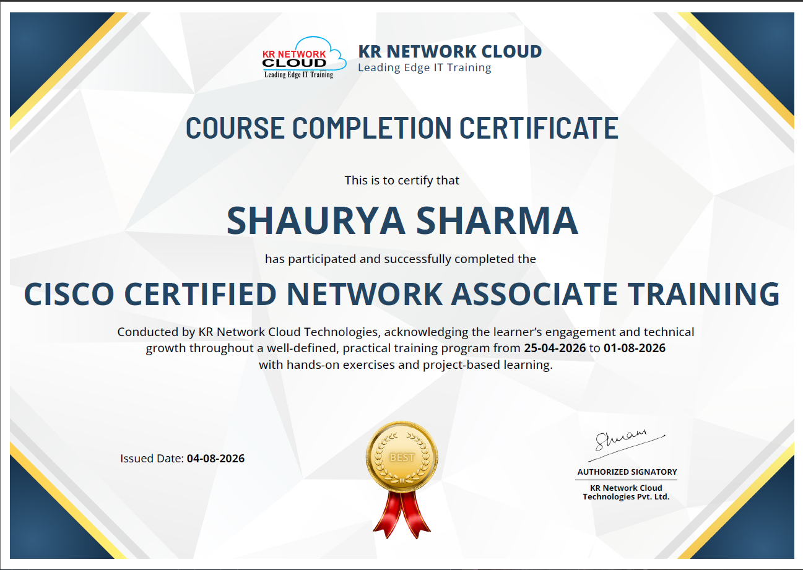

<div align="center">


<br/>


<br/><br/>

<a href="https://www.linkedin.com/in/shaurya-sharma-828741325/"></a>
<a href="mailto:shaurya.shrma7@gmail.com"></a>
<a href="https://github.com/Shaurya-codesx"></a>

<br/><br/>


</div>

---

<div align="center">

## 🚀 About Me

</div>

I'm an Android-focused engineer currently pursuing a B.Tech in Computer Science (AI) at Maharaja Agrasen Institute of Technology, Delhi. My focus is building performant, production-grade native Android applications using **Kotlin** and **Jetpack Compose**, with a strong emphasis on translating product requirements into clean, intuitive **UI/UX**.

I approach every build with a product engineering mindset — architecting for scalability and testability while sweating the details of motion, layout, and visual hierarchy. I'm currently deepening my expertise across the full mobile stack, from local persistence and networking to backend integration, by shipping real, deployable applications end-to-end.

<div align="center">


</div>

---

<div align="center">

## 🛠️ Tech Stack

**Languages**
<br/>


**Android Frameworks & UI**
<br/>


**Architecture & Local Storage**
<br/>


**Backend as a Service & Tooling**
<br/>


</div>

---

<div align="center">

## ⚙️ Android Expertise

| Domain | Proficiency | Details |
|:---:|:---:|:---|
| UI/UX Development | ⭐⭐⭐⭐⭐ | Jetpack Compose, Material You, custom design systems, adaptive layouts |
| Architecture | ⭐⭐⭐⭐ | MVVM, unidirectional data flow, ViewModel + State |
| Local Persistence | ⭐⭐⭐⭐ | Room, SQLite, offline-first data handling |
| Networking | ⭐⭐⭐⭐ | REST APIs, WebSockets, JWT-based authentication |
| Backend Integration | ⭐⭐⭐⭐ | Firebase, Ktor, Docker-based deployments |
| Version Control & CI/CD | ⭐⭐⭐⭐ | Git, GitHub Actions |

</div>

---

<div align="center">

## 💡 Featured Projects

</div>

<details>
<summary><b>📚 StudySync — Full-Stack AI-Powered Study Platform</b></summary>
<br/>

A full-stack study companion built end-to-end: a Ktor backend paired with a native Jetpack Compose Android client. StudySync generates AI-powered spaced-repetition flashcards and supports live, real-time collaborative study rooms, backed by a production-style backend with authentication, persistence, and CI/CD.

| | |
|---|---|
| **Stack** | Kotlin, Jetpack Compose, Ktor, PostgreSQL, WebSockets, JWT |
| **Architecture** | MVVM (Android client) · Layered REST + WebSocket backend |
| **Impact** | AI-generated spaced-repetition flashcards · Real-time collaborative study rooms · Dockerized backend with GitHub Actions CI/CD |
| **Repository** | [github.com/Shaurya-codesx/StudySync](https://github.com/Shaurya-codesx/StudySync) |

</details>

<br/>

<details>
<summary><b>🏃 Fitness-Tracker — Native Android Run & Fitness Tracker</b></summary>
<br/>

A native Kotlin fitness and run-tracking application built with Jetpack Compose, featuring a fully custom Material You design system. The app tracks runs and health metrics, then surfaces them through a cohesive pastel-themed analytics suite with custom chart visualizations.

| | |
|---|---|
| **Stack** | Kotlin, Jetpack Compose, Room, Vico (charts), Coil |
| **Architecture** | MVVM · Custom pastel Material You design system |
| **Impact** | Live run tracking · Custom analytics (distance, pace, energy, steps) · Full Material You redesign across every screen |
| **Repository** | [github.com/Shaurya-codesx/Fitness-Tracker](https://github.com/Shaurya-codesx/Fitness-Tracker) |

</details>

---

<div align="center">

## 🎓 Certifications

**Cisco Certified Network Associate Training (CCNA)**
<br/>
*Issued by KR Network Cloud Technologies*




</div>

---

<div align="center">

## 📊 GitHub Analytics


<br/>


</div>

---

<div align="center">

## 🏆 GitHub Trophies


</div>

---

<div align="center">

## 📈 Contribution Activity


</div>

---

<div align="center">

## 🐍 Contribution Snake


</div>

---

<div align="center">

## 🎯 Current Focus

</div>

```yaml
current_focus:
  learning:
    - Advanced Jetpack Compose (animations, custom layouts)
    - Kotlin Multiplatform (KMP)
  building:
    - StudySync — Ktor + Compose full-stack study platform
    - Fitness-Tracker — native Android run tracking app
  exploring:
    - Modern Android UI/UX trends
    - Scalable mobile app architecture
  open_to:
    - Entry-Level Android Developer roles
    - Mobile App Development internships
    - Open Source collaboration
```

---

<div align="center">

## 📫 Connect With Me

<a href="mailto:shaurya.shrma7@gmail.com"></a>
<a href="https://www.linkedin.com/in/shaurya-sharma-828741325/"></a>
<a href="https://github.com/Shaurya-codesx"></a>

</div>

---

<div align="center">

*"Great mobile experiences are built one screen, one state, and one thoughtful interaction at a time."*


</div>
